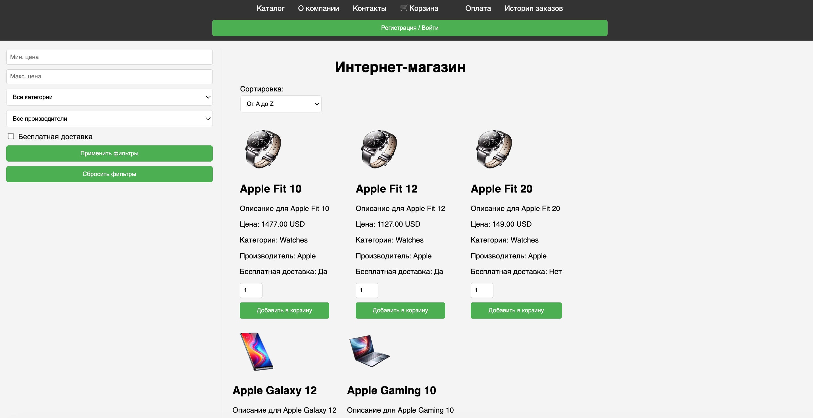
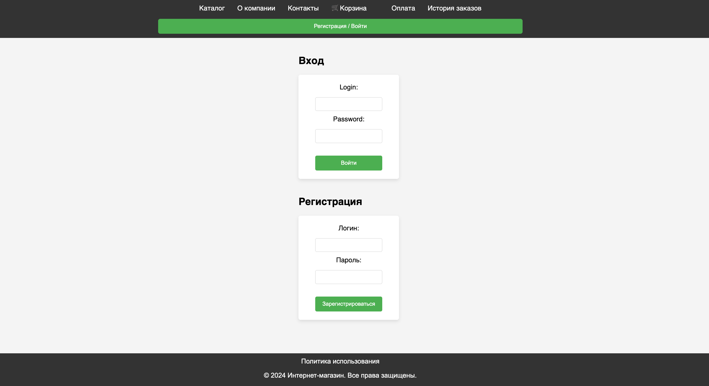

# Тестирование онлайн-магазина demoshopping.ru

> Проект выполнен в рамках курса "Функциональное тестирование ПО"  
> **Цель проекта** – протестировать модуль регистрации/логина на сайте онлайн-магазина и написать тестовую документацию в ходе и по результатам тестирования (чеклист проверок этих модулей, тест-кейсы и баг-репорты).

---

## 💻 Описание проекта

[demoshopping.ru](https://intern.demoshopping.ru/) - это тестировочный вебсайт магазина, где можно протестировать следующие функции: регистрация и логин пользователя, просмотр каталога товаров, добавление товаров в корзину, оформление заказа и оплата. В рамках этого проекта протестирован основной функционал регистрации и логина пользователя и создана тестовая документация.

**Требования** описаны в виде макетов в Figma, а для модуля регистрации/логина также доступны в виде пользовательских историй (user stories):
- [Макеты в Figma](https://www.figma.com/design/2T99Jt5OHPqkhe4yyoe2IC/demoshopping.ru?node-id=0-1&p=f)
- [User Stories](User-Stories.md)

### Главная страница 

### Страница регистрации/логина

---

## ⚙️ Процесс тестирования

**Тестирование** - ручное, функциональное, на основе требований в виде пользовательских историй и макета дизайнера.

**Техники тест-дизайна** - в ходе тестирования формы регистрации применялись техники эквивалентного разбиения и анализ граничных значений, при проверке требования авторизации для перехода на другие разделы онлайн-магазина использовалась техника таблицы принятия решений. 

### Применение эквивалентного разбиения

#### Форма регистрации - Поле "Логин"

> Требования: от 3 до 15 символов, буквы, цифры, символ `_`

| Класс | Описание | Значения |
|-------|-----|-------------------|
| Позитивный | От 3 до 15 валидных символов | `user_1`, `john_doe`, `alex123` |
| Негативный (слишком короткий ввод) | Меньше 3 валидных символов | `u`, `a_`, `12` |
| Негативный (слишком длинный ввод) | Больше 15 валидных символов | `this_is_very_long_username` |
| Негативный (недопустимые символы) | Содержит спецсимволы (кроме `_`) | `user@name`, `john.doe`, `user-name` |
| Негативный (пустое поле) | Пустая строка |  |

#### Форма регистрации - Поле "Пароль"

> Требования: минимум 8 символов, минимум одна буква и одна цифра

| Класс | Описание | Значения |
|-------|-----|-------------------|
| Позитивный | 8 или больше валидных символов | `password123`, `qwerty1q`, `Hello2026` |
| Негативный (слишком короткий ввод) | Меньше 8 валидных символов | `pass12`, `1234q` |
| Негативный (нет букв) | Только цифры | `12345678`, `11111111` |
| Негативный (нет цифр) | Только буквы | `password`, `qwertyui` |
| Негативный (пустое поле) | Пустая строка |  |

#### Форма входа - комбинированная проверка

> Требования: войти на сайт может только зарегистрированный пользователь

| Класс | Описание | 
|-------|-----|
| Позитивный | Введен логин и пароль зарегистрированного пользователя | 
| Негативный (неверный пароль) | Введен логин зарегистрированного пользователя с неправильным паролем |
| Негативный (неверный логин) | Введен несуществующий логин с паролем зарегистрированного пользователя | 
| Негативный (незарегистрированный пользователь) | Введен логин и пароль незарегистрированного пользователя | 
| Негативный (пустые поля) | Попытка входа с пустым полем логина и пароля |

### Анализ граничных значений

#### Форма регистрации - Поле "Логин"

> Границы: 3 и 15 символов

| Граница | Значение | Длина | Ожидаемый результат |
|---------|----------|-------|---------------------|
| Нижняя граница - 1 | `us` | 2 | ❌ Ошибка |
| **Нижняя граница** | `use` | 3 | ✅ Успех |
| Нижняя граница + 1 | `user` | 4 | ✅ Успех |
| Верхняя граница - 1 | `username123456` | 14 | ✅ Успех |
| **Верхняя граница** | `username1234567` | 15 | ✅ Успех |
| Верхняя граница + 1 | `username12345678` | 16 | ❌ Ошибка |

#### Форма регистрации - Поле "Пароль"

> Граница: 8 символов (минимальная длина)

| Граница | Значение | Длина | Содержит букву и цифру | Ожидаемый результат |
|---------|----------|-------|------------------------|---------------------|
| Граница - 1 | `pass123` | 7 | ✅ Да | ❌ Ошибка |
| **Граница** | `pass1234` | 8 | ✅ Да | ✅ Успех |
| Граница + 1 | `pass12345` | 9 | ✅ Да | ✅ Успех |
| Граница (нет буквы) | `12345678` | 8 | ❌ Нет | ❌ Ошибка |
| Граница (нет цифры) | `password` | 8 | ❌ Нет | ❌ Ошибка |

В результате можно сформировать следующий набор проверок формы регистрации и формы логина в онлайн-магазине:

| № | Модуль | Описание проверки | Ожидаемый результат |
|---|----------|----------------|---------------------|
| 1 | Форма регистрации| Валидный логин и валидный пароль | ✅ Регистрация успешна |
| 2 | Форма регистрации  | Логин с недопустимыми символами | ❌ Сообщение об ошибке |
| 3 | Форма регистрации | Пустое поле логина | ❌ Сообщение об ошибке |
| 4 | Форма регистрации  | Граничное значение: 3 валидных символа | ✅ Регистрация успешна |
| 5 | Форма регистрации | Граничное значение: 15 валидных символов | ✅ Регистрация успешна |
| 6 | Форма регистрации | Граничное значение: 2 валидных символа | ❌ Сообщение об ошибке |
| 7 | Форма регистрации | Граничное значение: 16 валидных символов | ❌ Сообщение об ошибке |
| 8 | Форма регистрации | Пароль без букв (только цифры), гр. значение 8 символов | ❌ Сообщение об ошибке |
| 9 | Форма регистрации | Пароль без цифр (только буквы), гр. значение 8 символов | ❌ Сообщение об ошибке |
| 10 | Форма регистрации | Пустое поле пароля | ❌ Сообщение об ошибке |
| 11 | Форма регистрации | Граничное значение: 8 валидных символов | ✅ Регистрация успешна |
| 12 | Форма регистрации | Граничное значение: 9 валидных символов | ✅ Регистрация успешна |
| 13 | Форма регистрации | Граничное значение: 7 валидных символов  | ❌ Сообщение об ошибке |
| 14 | Форма входа | Ввод логина и пароля зарегистрированного пользователя  | ✅ Успешный вход|
| 15 | Форма входа | Ввод невалидного пароля и логина зарегистрированного пользователя  | ❌ Сообщение об ошибке |
| 16 | Форма входа | Ввод невалидного логина и пароля зарегистрированного пользователя  | ❌ Сообщение об ошибке |
| 17 | Форма входа | Ввод логина и пароля незарегистрированного пользователя  | ❌ Сообщение об ошибке |
| 18 | Форма входа | Попытка входа с незаполненными полями логина и пароля  | ❌ Сообщение об ошибке |

---

### Таблица принятия решений 

С помощью этой техники тест-дизайна мы определим правила доступа к разделам магазина (страницам) в зависимости от статуса авторизации пользователя. Три страницы магазина доступны только после авторизации - это Корзина, История заказов и Оплата. Остальные (Каталог, О компании, Контакты) являются публичными и доступны вне зависимости от авторизации.

---

**Таблица (полная)**

| № | Авторизация | Страница | Сообщение об авторизации | Пояснение |
|---|-----------------|-------------|------------------------------|-----------|
| 1 | **Да** | Корзина | **Нет** | Авторизованный пользователь имеет доступ ко всем страницам |
| 2 | **Да** | История заказов | **Нет** | Авторизованный пользователь имеет доступ ко всем страницам |
| 3 | **Да** | Оплата | **Нет** | Авторизованный пользователь имеет доступ ко всем страницам |
| 4 | **Да** | Любая другая | **Нет** | Авторизованный пользователь имеет доступ ко всем страницам |
| 5 | **Нет** | Корзина | **Да** | ❌ Требуется авторизация |
| 6 | **Нет** | История заказов | **Да** | ❌ Требуется авторизация |
| 7 | **Нет** | Оплата | **Да** | ❌ Требуется авторизация |
| 8 | **Нет** | Любая другая | **Нет** | ✅ Доступ разрешён (публичная страница) |

---

Можно сократить таблицу и соответственно количество тест-кейсов, объединив п.1-4 в один, так как при авторизации пользователя доступ будет во все разделы магазина и достаточно будет проверить любую вкладку магазина с авторизованным пользователем, а с неавторизованным пользователем требуется проверить каждую защищённую вкладку (Корзина, История заказов, Оплата) и любую из публичных.

**Таблица (сокращенная)**

| № | Авторизация | Страница | Сообщение об авторизации | Пояснение |
|---|-----------------|-------------|------------------------------|-----------|
| 1 | **Да** | Корзина/История заказов/Оплата/Любая страница | **Нет** | Авторизованный пользователь имеет доступ ко всем страницам |
| 2 | **Нет** | Корзина | **Да** | ❌ Требуется авторизация |
| 3 | **Нет** | История заказов | **Да** | ❌ Требуется авторизация |
| 4 | **Нет** | Оплата | **Да** | ❌ Требуется авторизация |
| 5 | **Нет** | Любой другой | **Нет** | ✅ Доступ разрешён (публичная страница) |

#### Проверки на основе оптимизированной таблицы

| № | Авторизация | Страница | Ожидаемый результат |
|---|-------------|---------|---------------------|
| 1 | Да | Корзина / История / Оплата / Любая другая | Открывается выбранная страница |
| 2 | Нет | Корзина | Отображается сообщение о необходимости авторизации |
| 3 | Нет | История заказов | Отображается сообщение о необходимости авторизации |
| 4 | Нет | Оплата | Отображается сообщение о необходимости авторизации |
| 5 | Нет | Главная / Каталог / Контакты | Открывается выбранная страница |

---
По результатам анализа классов эквивалентности и граничных значений, а также таблицы принятия решений были сформированы тест-кейсы для проверки формы регистрации и логина и доступа пользователя к разделам магазина в зависимости от статуса авторизации.

## 📊 Результаты тестирования 

В чеклисте тестирования содержатся основные проверки для модуля логина и регистрации - на основе пользовательских историй. Эти проверки были дополнены проведенным выше анализом в соответствии с техниками тест-дизайна, и затем я разработала подробные тест-кейсы для полноценного тестирования модуля. В результате завела несколько баг-репортов по обнаруженным дефектам. Тестовая документация, выгруженная в виде pdf, находится в папке [test-artifacts](test-artifacts) - для удобства можно также посмотреть по этим ссылкам:

- [Чеклист - ссылка на гугл-таблицу](https://docs.google.com/spreadsheets/d/1PDB1S-JbiSdGEvUOIi5YzPj1P6BV81LnLYyTL4tWFMU/edit?usp=sharing) 

- [Тест-кейсы - ссылка на гугл-таблицу](----)

- [Баг-репорты - ссылка на гугл-таблицу](----) 

